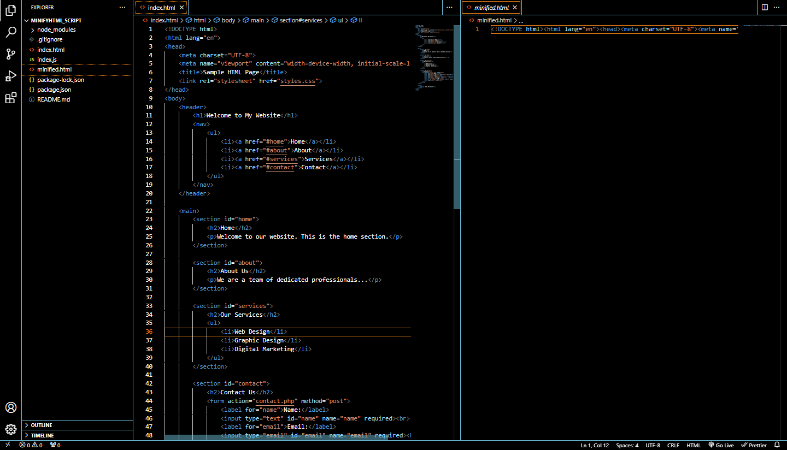

# HTML Minifier using Node.js

This Node.js script allows you to easily minify HTML files by removing unnecessary whitespace, line breaks, and comments. It's a handy tool for optimizing your HTML files for web deployment.

## Usage

## Example

* I used some random html content found on internet and this is the result i get:



### Prerequisites

Before using this script, make sure you have Node.js installed on your system. You can download it from [nodejs.org](https://nodejs.org/).

### Installation

1. Clone this repository to your local machine:

   ```bash
   git clone https://github.com/yourusername/html-minifier.git

2. Navigate to the project directory:

```
cd html-minifier
```

3. Install the required dependencies:

```
npm install
```

### Minify HTML

1. Place the HTML file you want to minify in the root directory of the project. This HTML file should contain only the HTML structure and it should be called `index.html`, do not include any `<style>` or `<script>` tags.
2. Open your terminal and run the following command:

```
node index
```
This will execute the minification process on the index.html file in the root directory.

3. The minified HTML will be saved as minified.html in the same directory.

### Acknowledgments

* This project uses [html-minifier](https://github.com/kangax/html-minifier)

### Contributing

If you'd like to contribute to this project or report issues, please open an issue or create a pull request on the [GitHub repository](https://github.com/Djomlica/minifyHTML-script_node.git).